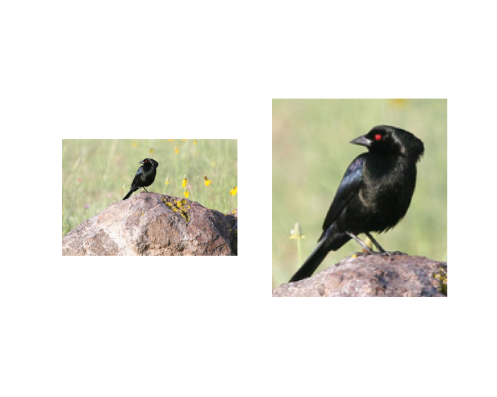
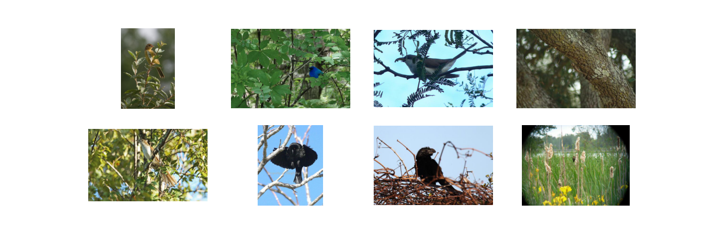

# Bird_classification
Project on classifying 20 different species of bird for a Kaggle challenge of the MVA course

## Requirements
  * Python 3.3+ 
  * Pytorch (ideally with a GPU for fast computation)
  * Darknet for bird detection

## Dataset & Preprocessing
The Dataset is a subset of the Caltech-UCSD Birds-200-2011 bird dataset. For getting the dataset and a starting example of script you can clone this repository : https://github.com/willowsierra/recvis19_a3.

I used yolov3 model to extract bounding boxes of birds before applying classification models. My code include steps for installing the library darknet. Figure below shows the output of darknet applied on a couple of images.

  

Yolov3 did not success to extract bird on a couple of images. Here are some examples.

  

## Trained Models & Quantitaves Results
I've used transfert learning with 2 differents models to classify the images on the dataset.

  * Pre-trained  Resnet101 on the dataset ImageNet
  *  Pre-trained  InceptionV3 on the dataset INaturalist
The .ipynb contains all the script to reproduce the results i obtained. It can be run on Google Colab. 
The performance in terms of accuracy of the models are in the following table : 

| Algorithm  | Precision on Validation |Precision on public part |
| ------------- | ------------- | ------------- |
| InceptionV3 | 92 | 86.45 |
| Resnet101  | 94 | 80.0 |

Bert with Attention outperforms the other methods

## Qualitative Results

I've plot a TSNE representation of images of the validation set

  

